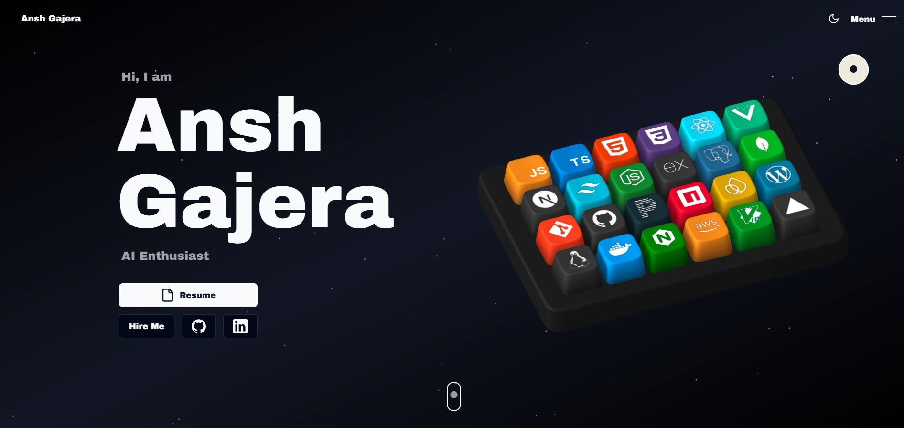
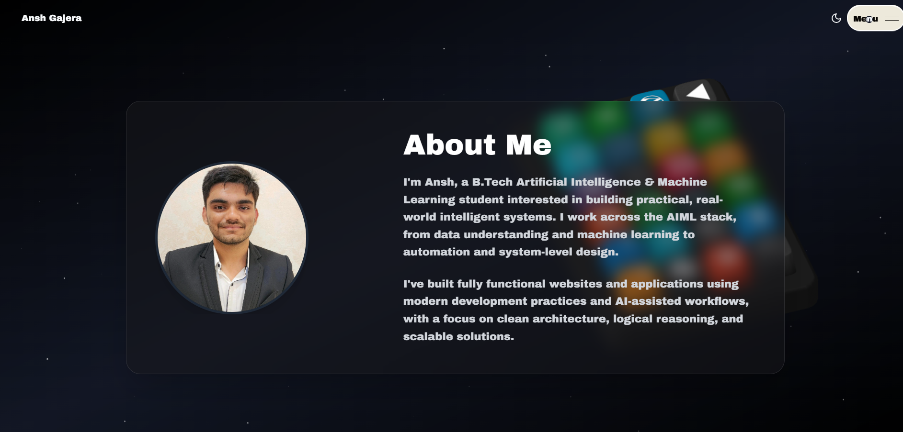
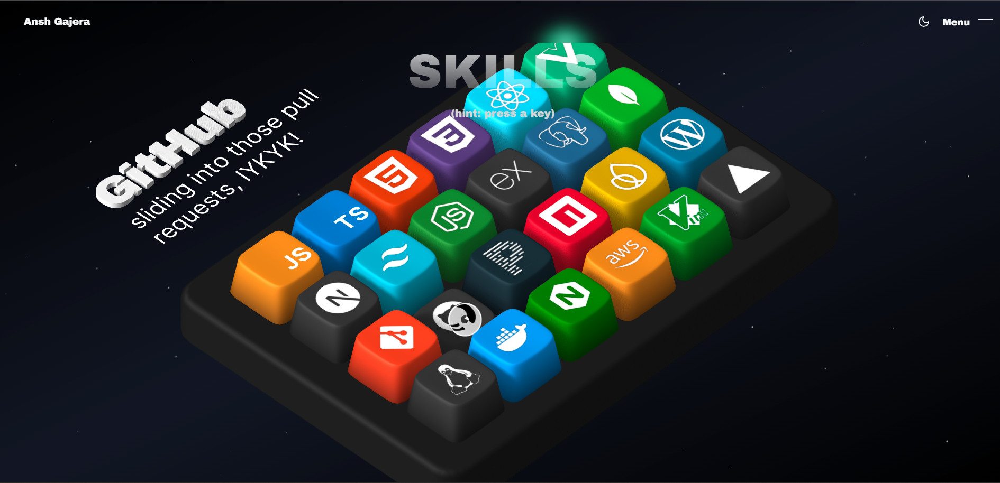
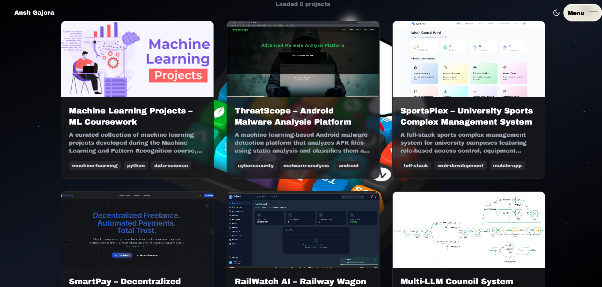
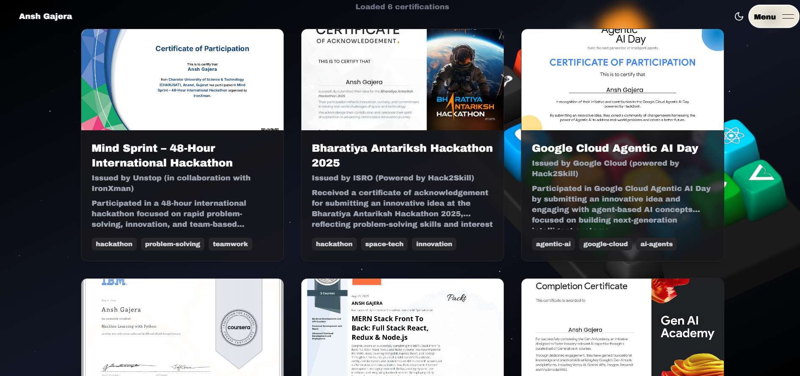
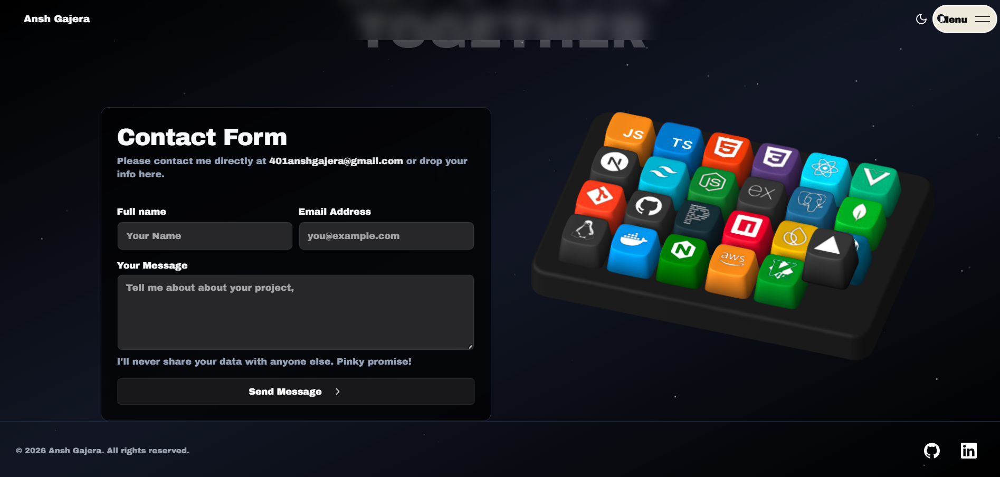

<div align="center">



# 🚀 Kevin Gandhi — Personal Portfolio

[](https://nextjs.org/)
[](https://www.typescriptlang.org/)
[](https://www.mongodb.com/)

A full-stack personal portfolio website featuring smooth animations, 3D interactive elements, a dynamic blog, project showcases, and certifications — powered by a custom-built Next.js backend with MongoDB.

</div>

---

## 📸 Screenshots

<table>
  <tr>
    <td align="center"><strong>🏠 Landing</strong></td>
    <td align="center"><strong>👤 About</strong></td>
  </tr>
  <tr>
    <td></td>
    <td></td>
  </tr>
  <tr>
    <td align="center"><strong>🛠️ Skills</strong></td>
    <td align="center"><strong>📁 Projects</strong></td>
  </tr>
  <tr>
    <td></td>
    <td></td>
  </tr>
  <tr>
    <td align="center"><strong>🏆 Certifications</strong></td>
    <td align="center"><strong>📬 Contact</strong></td>
  </tr>
  <tr>
    <td></td>
    <td></td>
  </tr>
</table>

---

## ✨ Features

- **🎹 3D Interactive Keyboard** — Built with Spline; each keycap represents a skill with hover interactions
- **🎞️ Smooth Animations** — GSAP & Framer Motion powered scroll, hover, and reveal animations
- **🌌 Animated Background** — Dynamic particle-based background for a futuristic look
- **📱 Fully Responsive** — Optimised for all screen sizes, from mobile to desktop
- **📝 Blog** — Markdown-powered blog posts fetched dynamically from the backend
- **📁 Project Showcases** — Dynamic project pages with image carousels and detail views
- **🏆 Certifications** — Showcase of completed courses and certifications
- **📬 Contact Form** — Email delivery via Nodemailer / Resend API
- **🌙 Dark / Light Mode** — Seamless theme switching with `next-themes`
- **🔒 Admin Panel Backend** — JWT-authenticated REST API for content management

---

## 🗂️ Project Structure

```
kevin-gandhi-portfolio/
├── frontend/          # Next.js 14 frontend (port 3000)
│   ├── src/
│   │   ├── app/       # Next.js App Router pages
│   │   ├── components/# Reusable UI components & sections
│   │   ├── lib/       # API utilities & helpers
│   │   ├── hooks/     # Custom React hooks
│   │   └── types/     # TypeScript type definitions
│   └── public/
│       └── assets/    # Images, icons, Spline files, screenshots
└── backend/           # Next.js 16 API backend (port 4000)
    ├── app/api/       # REST API routes
    ├── src/
    │   ├── models/    # Mongoose models (Project, Blog, Certification)
    │   ├── services/  # Business logic layer
    │   └── controllers/
    └── seeds/         # Database seed scripts
```

---

## 🛠️ Tech Stack

### Frontend
| Technology | Purpose |
|---|---|
| **Next.js 14** | React framework with App Router |
| **TypeScript** | Type-safe development |
| **Tailwind CSS** | Utility-first styling |
| **Framer Motion** | Page & element animations |
| **GSAP** | Advanced scroll-triggered animations |
| **Spline** | 3D interactive keyboard scene |
| **Shadcn / Radix UI** | Accessible UI primitives |
| **Lenis** | Smooth scroll library |
| **Nodemailer** | Contact form email sending |

### Backend
| Technology | Purpose |
|---|---|
| **Next.js 16** | API route server |
| **MongoDB + Mongoose** | Database & ODM |
| **JWT + bcryptjs** | Authentication & password hashing |
| **Cloudinary** | Image hosting & optimisation |
| **Nodemailer** | Email notifications |

---

## 🚀 Getting Started

### Prerequisites
- Node.js 18+
- MongoDB instance (local or Atlas)
- Cloudinary account (for image uploads)
- Resend / SMTP credentials (for contact emails)

### 1. Clone the repository
```bash
git clone https://github.com/QuanTaLPha06/kevin-gandhi-portfolio.git
cd kevin-gandhi-portfolio
```

### 2. Set up the Backend (Port 4000)
```bash
cd backend
npm install
```

Create a `.env` file in the `backend/` directory:
```env
MONGODB_URI=your_mongodb_connection_string
JWT_SECRET=your_jwt_secret
CLOUDINARY_CLOUD_NAME=your_cloud_name
CLOUDINARY_API_KEY=your_api_key
CLOUDINARY_API_SECRET=your_api_secret
```

```bash
npm run dev
```

### 3. Set up the Frontend (Port 3000)
```bash
cd frontend
npm install
```

Create a `.env` file in the `frontend/` directory:
```env
NEXT_PUBLIC_BACKEND_URL=http://localhost:4000
RESEND_API_KEY=your_resend_api_key
```

```bash
npm run dev
```

### 4. Open in browser
```
http://localhost:3000
```

---

## 🔌 API Overview

The backend exposes a RESTful API with 19 endpoints across 5 resource categories:

| Resource | Public Endpoints | Auth-Protected Endpoints |
|---|---|---|
| **Projects** | `GET /api/projects` | POST, PUT, DELETE, PATCH (priority) |
| **Blogs** | `GET /api/blogs` | POST, PUT, DELETE |
| **Certifications** | `GET /api/certifications` | POST, PUT, DELETE |
| **Auth** | `POST /api/auth/login` | /me, /logout, /update |
| **Upload** | — | `POST /api/upload` |

See [`docs/BACKEND_API_ENDPOINTS.md`](docs/BACKEND_API_ENDPOINTS.md) for full documentation.

---

## 🚢 Deployment

Both the frontend and backend are deployed on **Vercel**.

- **Frontend**: Set `NEXT_PUBLIC_BACKEND_URL` and `RESEND_API_KEY` in Vercel environment variables.
- **Backend**: Set `MONGODB_URI`, `JWT_SECRET`, and Cloudinary credentials in Vercel environment variables.

---

## 📬 Contact

Feel free to reach out for collaborations, feedback, or just to say hi!

- 💼 **GitHub:** [@QuanTaLPha06](https://github.com/QuanTaLPha06)
- 📧 **Email:** [gandhikevin06@gmail.com](mailto:gandhikevin06@gmail.com)

---

<div align="center">

⭐ If you like this project, give it a star!

</div>

